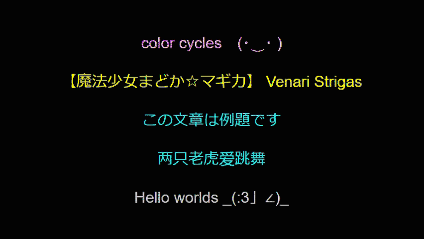

# ColorCycles - a Javascript class to transition between font-colors

-----

## colorCycles preview example:


## usage
- the logic for updating colors in HTML elements is in `class ColorCycles` in `colorCycles.js`
- a ColorCycles instance is initialized through a dictionary with the keys `colors`, `pause`, `transition`, and `elemQueries`:
- an example initialization of ColorCycles is:
```
let myTest = new ColorCycles({
	colors: ["yellow", "pink", "teal", "springgreen"],
	pause: '1000',
	transition: '0.5s',
	elemQueries: ["#testText"],
});
myTest.startColors(); // do the color cycles

/*
 * myTest will update in the font-color sequence of yellow then pink, then teal, then springgreen, and repeat; during each font-color cycle it will pause for one second and then transition to the next color in 0.5 seconds; this behavior will be applied to the HTML elements queried by the string "#testText"
 * the call to the instance's startColors() function will initialize the color cycling behavior.
 */
```

## test preview
- example colorCycles webpage can be run in a web browser by checking out the repo and opening `index.html` in a web browser
- the example implementation in the colorCycles.js file (below the ColorCycles class) can be updated to test instantiation configs